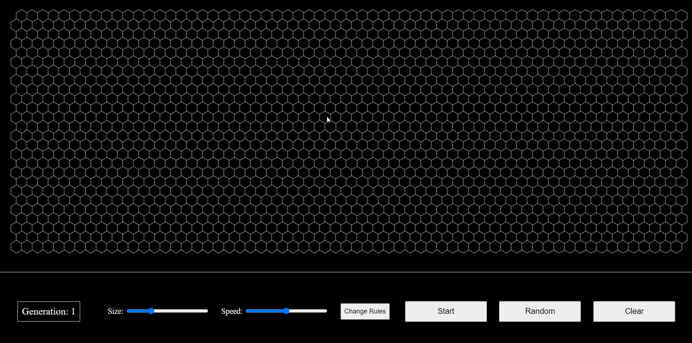
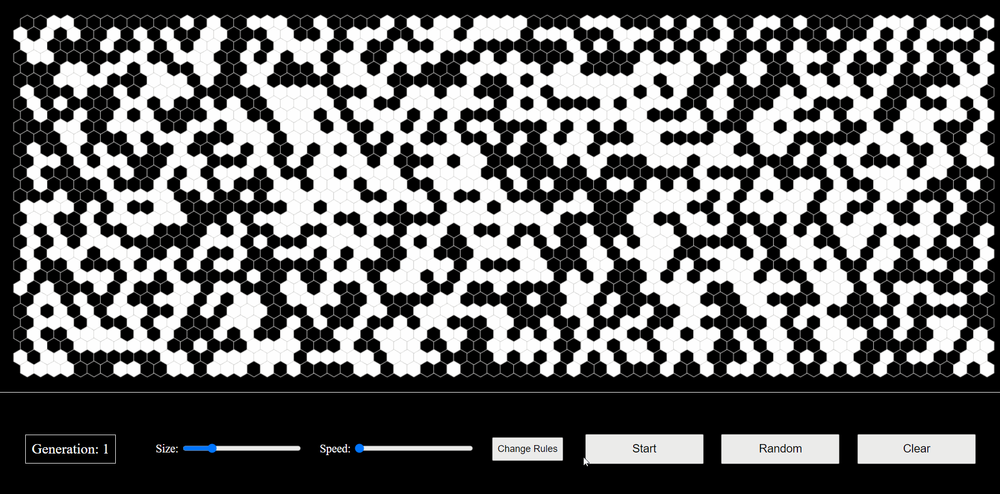

# Hex Game of Life

This is my final project for the [Harvard’s CS50](https://cs50.harvard.edu/) course. Live version is available [here](https://salkirr.github.io/hex-game-of-life/).

## About

It is [Conway's Game of Life](https://en.wikipedia.org/wiki/Conway%27s_Game_of_Life) on a hexagonal grid made with JavaScript and HTML5 Canvas.

## Features

#### Draw

#### Change grid size

#### Change game speed

#### Change game rules

